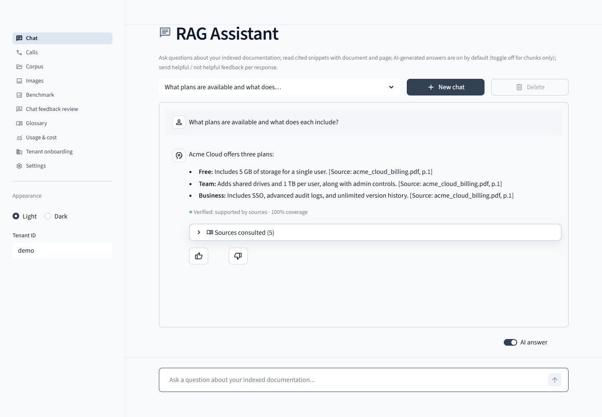
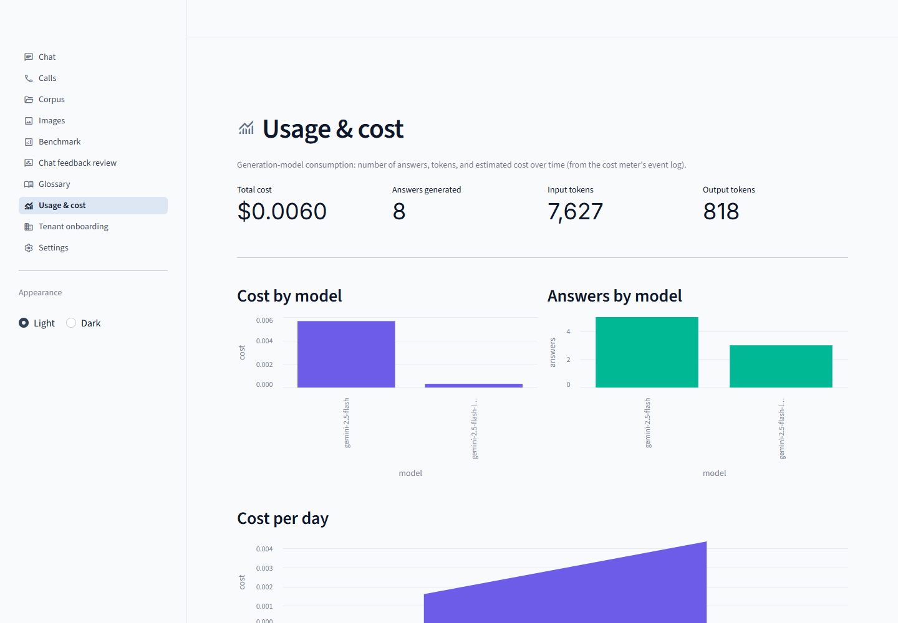
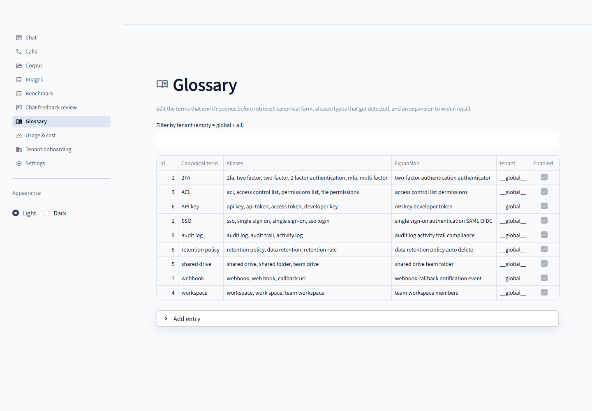

# RAG Assistant

Retrieval-augmented Q&A over your documents — a FastAPI backend + Streamlit UI with
provider-agnostic generation, a post-generation grounding check, glossary-aware query
preprocessing, and built-in cost/usage tracking.

## Features

- **Grounded answers with citations** — embed → vector search → rerank → generate, with a
  post-generation *grounding guard* that flags answers not supported by the retrieved sources.
- **Provider-agnostic generation** — Gemini / OpenAI-compatible / Ollama behind one factory,
  selectable per query, with per-call token-usage accounting.
- **Query understanding** — glossary-aware preprocessing (alias → canonical + recall expansion)
  and an optional intent planner that asks a clarifying question when a query is ambiguous.
- **Cost & usage dashboard** — every generation is priced from token usage; see per-model spend,
  tokens, and a daily trend.
- **Editable glossary**, **multi-format ingestion** (PDF / DOCX / PPTX / XLSX), **multi-tenant**
  filtering, **feedback** capture, and a **benchmark** harness.

## Screenshots

**Chat — grounded answer with citations**



| Usage &amp; cost dashboard | Glossary admin |
| --- | --- |
|  |  |

> The bundled demo corpus is **generic, synthetic** "Acme Cloud" product docs
> (`demo_docs/`, regenerate with `python scripts/make_demo_corpus.py`) — no real data.

## Quick Start

```bash
# 1. Copy and fill in API keys
cp .env.example .env

# 2. Start full stack
docker-compose up --build

# 3. Access
#    API:  http://localhost:8000
#    UI:   http://localhost:8501
#    Docs: http://localhost:8000/docs
```

## Testing (CI + local)

```bash
pip install -r requirements.txt -r requirements-dev.txt
python -m pytest tests/ -q
```

GitHub Actions runs the same on push/PR to `main` / `master`.

## Gemini latency smoke (Flash vs Flash-Lite)

With `GOOGLE_API_KEY` set:

```bash
python scripts/model_latency_smoke.py
# Defaults follow config/models.yaml (gemini-2.5-flash). Compare vs flash-lite via GEMINI_* overrides.
```

## Local Development (no Docker)

```bash
# Install dependencies
pip install -r requirements.txt

# Start Qdrant + Redis (Docker still needed for these)
docker-compose up qdrant redis -d

# Run API
uvicorn api.main:app --reload --port 8000

# Run UI (separate terminal)
pip install -r requirements-ui.txt
streamlit run ui/app.py
```

## Ingestion

Put files in a local `./docs` directory (ignored by git). Inside the API container this is `/app/docs`.

- **Parallel workers:** set `INGESTION_WORKERS` (default `4`) in `.env` or pass `workers` in `POST /ingest/start`.
- **Resume after failures:** failed paths are written to `data/ingest_checkpoint.json`. Call `POST /ingest/start` with `{"resume": true, "path": ""}` to retry only those files (uses `force` internally).
- **Status:** `GET /ingest/status` returns totals, `failed_files`, `succeeded_recent`, `progress_pct`, `checkpoint_failed_pending`, `can_resume`, etc.

```bash
curl -X POST http://localhost:8000/ingest/start \
  -H "Content-Type: application/json" \
  -d '{"path": "/app/docs", "force": false, "workers": 4}'

curl -X POST http://localhost:8000/ingest/start \
  -H "Content-Type: application/json" \
  -d '{"path": "", "resume": true}'
```

## Models (Gemini)

Default Gemini IDs in `config/models.yaml` are **gemini-2.5-flash** (vision + generation). Override via `GEMINI_VISION_MODEL` / `GEMINI_GENERATION_MODEL` (e.g. `gemini-2.5-flash-lite` for lower cost). Product name and prompt wording come from `config/product.yaml`.

## API Reference

| Endpoint | Method | Description |
|----------|--------|-------------|
| `/query` | POST | RAG retrieval — question → ranked chunks with citations |
| `/ingest` | POST | Trigger document ingestion pipeline |
| `/feedback` | POST | Store user rating + correction for a query result |
| `/health` | GET | API + Qdrant + Redis connectivity check |
| `/stats` | GET | Corpus statistics |
| `/docs/{doc_id}` | GET | Metadata for a specific document |
| `/corpus` | DELETE | Clear all indexed data (requires X-Admin-Token header) |
| `/ingest/start` | POST | Background ingest (`path`, `force`, `resume`, `workers`) |
| `/ingest/status` | GET | Progress, failed list, checkpoint hints |
| `/ingest/pause` | POST | Pause background ingest |
| `/ingest/resume` | POST | Resume after pause |
| `/ingest/cancel` | POST | Cancel background ingest |
| `/config/pipeline` | GET | WP12 merged pipeline config (YAML → JSON) |
| `/library/documents` | GET | List indexed docs + `media/` filenames (not under `/corpus/` — avoids StaticFiles clash) |

Set `cache.mode` to `semantic` in `config/models.yaml` for Tier‑3 semantic cache (Redis + embedding similarity ≥ `semantic_min_similarity`).

## Architecture

```
Streamlit UI (:8501)
      ↓
  FastAPI (:8000)
      ↓
  ┌─────────┬──────────┐
  │ Qdrant  │  Redis   │
  │ (:6333) │ (:6379)  │
  └─────────┴──────────┘
```

## Configuration

- `config/doc_types.yaml` — Chunking strategy per document type
- `config/tenants.yaml` — Tenant → module + version mapping (`erp_version` preferred; `legacy_erp_version` accepted as an alias)
- `config/models.yaml` — Embedding / reranker / vision model selection; `retrieval.benchmark_concurrency` controls parallel benchmark eval/analyze (overridable per request with `workers=` and env `BENCHMARK_WORKERS` when unset in YAML)
- `config/product.yaml` — Product name and prompt strings (white-label RAG + vision captions)

## Supported Formats

| Format | Converter | Notes |
|--------|-----------|-------|
| PDF | pymupdf4llm / pytesseract | OCR fallback for scanned docs |
| DOCX | pandoc + python-docx | |
| PPTX | LibreOffice → PDF → marker | Speaker notes extracted separately |
| XLSX | openpyxl → Markdown tables | |
